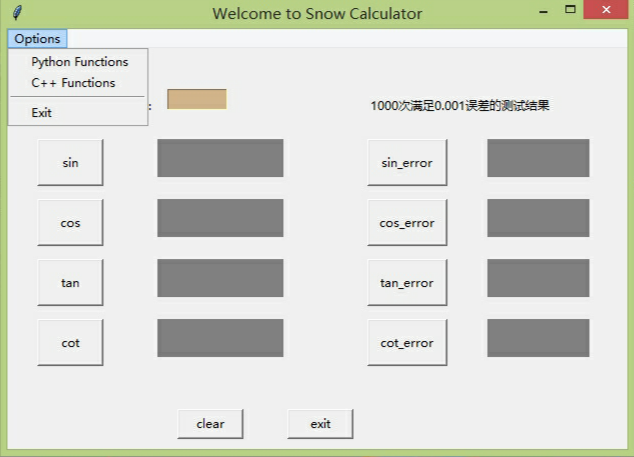
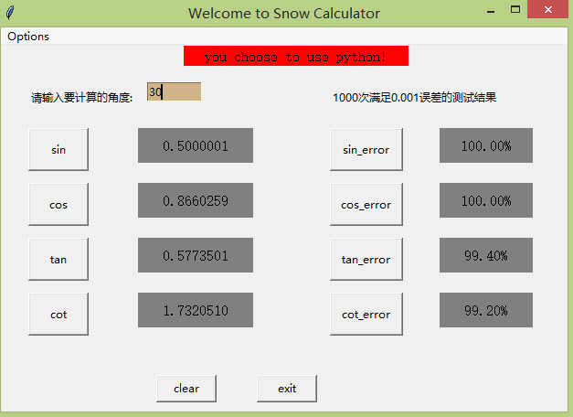

# se2020
三角函数软件工程项目(test分支)
编写软件：python、c++
--

### 运行
在安装好相应环境的情况下，直接执行主目录下的testmain.py即可进入主程序。C_test则为基于C++语言的单独测试模块。
### 界面
* （1）点击界面的options按钮下拉隐藏的工具，包含Python Language、C++ Language和Exit选项，可对后台执行三角函数计算采用的编辑语言进行选择或执行系统退出操作,新增显示当前使用语言的功能。

* （2）界面有个输入框，输入角度来计算三角函数的值（程序中会把角度自动转换为弧度来计算）。  
* （3）点击界面sin，cos，tan，cot按钮，可分别计算输入变量的正弦值，余弦值，正切值和余切值。
* （4）点击界面的右边的sin_error，cos-error,tan-error,cot-error即可分别自动输入1000次数据并计算误差。



### 代码
* （1）pch.cpp是使用c++语言实现的cos、cot、sin和tan函数，pch.h是其对应的头文件。
* （2）SnowC.dll是上述两个文件编译生成的Windows动态链接库文件，供python加载后调用c++方法来计算三角函数。
* （3）pySnow.py包括用python语言实现cos、cot、sin和tan函数。
* （4）main.py主要实现了三角函数运算界面（v1.0）显示（python语言），导入pySnow来执行python实现的三角函数，加载SnowC.dll调用C++语言实现的三角函数。
* （5）test.py（python语言）与tset.cpp（C++语言）主要实现了输入1000次数据，并与正确数据比较计算误差数据的功能。其中C++测试模块通过动态加载上一组同学生成的动态链接模块所计算的值与系统三角函数进行比较,测试模块通过调用mydll.dll计算三角函数值后与系统函数比较。
* （6）testmain.py主要实现了三角函数运算测试与原三角函数计算函数的界面(v2.0)显示（python语言）。
### 后台
* 界面尺寸、标题
```python
    window = tk.Tk()
    window.title("Welcome to Snow Calculator")
    window.geometry("620x400")
```
    
         
* 输入界面 角度
```python
var_angle_input = tk.StringVar()
entry_angle_input = tk.Entry(window,
                             textvariable=var_angle_input,
                             width=8,bg="tan")
entry_angle_input.place(x=160, y=40)
```
* 弧度输入
```python
def get_num():
    if (entry_angle_input.get() == ""):
        tk.messagebox.showwarning(title='Warning', message='PLEASE INPUT A NUMBER！')
        angle_value = float(entry_angle_input.get())
    else:
        angle_value = float(entry_angle_input.get())

    o = angle_value
    while angle_value > 360:
    	angle_value = angle_value - 360
    angle_value = angle_value * PI / 180

    return angle_value, o
```
* 三角函数值输出
```python
      t.insert("end", result)
```
         
* 界面按钮，例如
```python
btn_sin = tk.Button(window, text='sin',
                    width=8, height=2,command=snow_sin).place(x=30, y=90)
```
     
     
     
* 三角函数计算

  sin计算
  
```python
  def snow_sin():
  	var,_ = get_num()
  	if flag:
  		dll.c_sin.restype = ctypes.c_double
  		result = dll.c_sin(c_double(var))
  		print(str(var) + " " + str(result))
  	else:
  		result = sin(var)
  	var_sin_result.set("%.7f" % result)
```
  
  
  
```c++
  DLL_EXPORT double c_sin(double x)
      {
        int i = 1, negation = 1;//取反
          double sum = 0;
          double index = x;//指数
          double Factorial = 1;//阶乘
          double TaylorExpansion = x;//泰勒展开式求和
          do
          {
              Factorial = Factorial * ((__int64)i + 1) * ((__int64)i + 2);//求阶乘
              index *= x * x;//求num2的次方
              negation = -negation;//每次循环取反
              sum = index / Factorial * negation;
              TaylorExpansion += sum;
              i += 2;
          } while (myabs(sum) > 1e-15);
          return (TaylorExpansion);
      }
```
  
  
  
  cos计算
  
```python
  def snow_cos():
  	var,_ = get_num()
  	if flag:
  		dll.c_cos.restype = ctypes.c_double
  		result = dll.c_cos(c_double(var))
  	else:
  		result = cos(var)
  	var_cos_result.set("%.7f" % result)
```
  
  
  
```c++
  DLL_EXPORT double c_cos(double x)
      {
          x = (PI / 2) - x;
          return c_sin(x);
      }
```
  


tan计算

```python
def snow_tan():
	var,o = get_num()
	if o != 0 and (o % 90 == 0 and o / 90 % 2 != 0):
		var_tan_result.set("inexistence")
	else:
		if flag:
			dll.c_tan.restype = ctypes.c_double
			result = dll.c_tan(c_double(var))
		else:
			result = tan(var)
		var_tan_result.set("%.7f" % result)
```


```c++
DLL_EXPORT double c_tan(double x)
    {
        return (c_sin(x) / c_cos(x));
    }
```


cot计算

```python
def snow_cot():
	var,o = get_num()
	if o % 90 == 0:
		if o / 90 % 2 == 0:
			var_cot_result.set("inexistence")
		if o / 90 % 2 != 0:
			var_cot_result.set("%.7f" % 1.0)
	else:
		if flag:
			dll.c_cot.restype = ctypes.c_double
			result = dll.c_cot(c_double(var))
		else:
			result = cot(var)
		var_cot_result.set("%.7f" % result)
```


```c++
DLL_EXPORT double c_cot(double x)
{
        return (1 / c_tan(x));
}
```

* 计算三角函数的误差（以sin函数为例，具体位于代码注释）

sin误差计算
```python
def test_sin():
    num_test = 0
    count_sin = 0
    while num_test<1000:
        a = round(random.uniform(0,360),3)
        m1 = float(sin(a*PI/180))-math.sin(a*PI/180)
        if m1<=0.001:
            count_sin =count_sin + 1
        num_test = num_test + 1
        n1 = round(count_sin/10,2)
    #print(n1)
    return n1
```
输出sin误差结果
```python
def snow_test_sin():
    if flag:
        result = round(100,2)
    else:
        result = test_sin()
    var_error_sin.set("%.2f%%" % result)
```
```python
var_error_sin = tk.StringVar()
l_error_sin = tk.Label(window,width=12, height=2,
                 textvariable=var_error_sin,font=(12),bg="gray")
l_error_sin.place(x=480, y=90)
```

# ChangeLog
  **2020年5月4日**
-    README说明文件更新

  **2020年5月3日**
-    上传界面文件（V2.0)
-    上传测试文件（python与C++语言）

